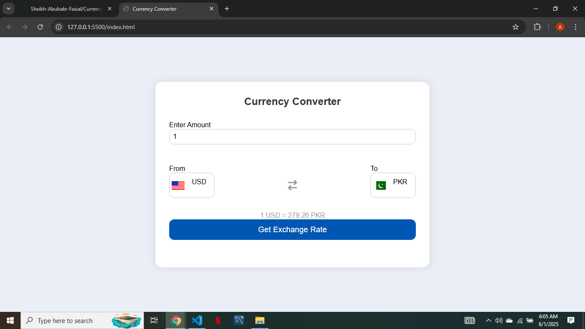

# 💱 Currency Converter

A real-time currency converter built using **HTML**, **CSS**, and **Vanilla JavaScript**. It allows users to convert between different currencies using exchange rates.

## 🚀 Features

- Convert from one currency to another
- Real-time exchange rates (optional API-based version)
- Simple and clean UI

## 🛠️ Tech Stack

- HTML5
- CSS3
- JavaScript (Vanilla)

## 📸 Screenshot

 

## 🎯 Live Demo

[Visit Site](https://sheikh-abubakr-faisal.github.io/Currency-Converter/)

## 👨‍💻 Author

**Sheikh Abubakr Faisal**  
[abubakrsheikh44@gmail.com](mailto:abubakrsheikh44@gmail.com)

## 📄 License

This project is for learning purposes only.
